# EKS Deployment of 2048 Game Application with ALB Ingress Controller....

## Overview
This project demonstrates deploying the 2048 game on Amazon EKS with Fargate and ALB. By following this guide, you’ll have a fully functioning game on AWS with load balancing and scalability.


## Prerequisites
Before we begin, make sure you have the following tools installed on your system:

- AWS CLI: This command-line tool allows you to interact with AWS services.
- eksctl: A handy tool that simplifies the process of creating and managing EKS clusters.
- kubectl: This command-line tool enables you to communicate with your Kubernetes clusters.
- Helm: A package manager for Kubernetes that makes it easier to deploy, manage, and version applications within your cluster.


### Once these are installed, use the following command to configure your AWS credentials.

```bash
aws configure
```


---

## Deployment Steps

### 1. Create a cluster on EKS. Depending on your internet speed, the cluster will take 10–15 minutes to connect.

```bash
eksctl create cluster --name demo-cluster --region us-east-1 --fargate
```

*This command sets up a new EKS cluster named demo-cluster in the us-east-1 region*.


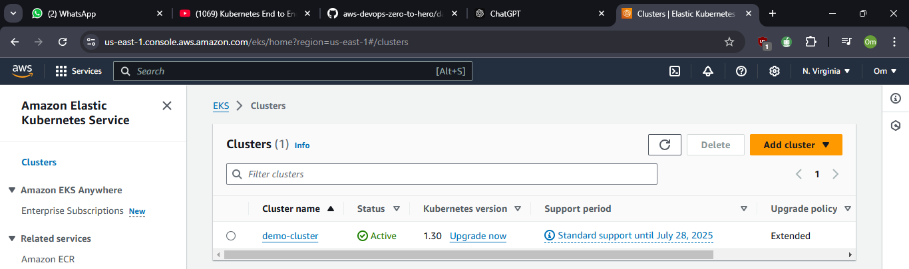
> Cluster is created

### 2. Update Kubeconfig on your EKS cluster.
```bash
aws eks update-kubeconfig --name demo-cluster --region us-east-1
```
*This will connect your cluster with kubectl command line you will avail to control your cluster using kubectl command*.

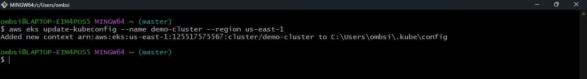


### 3. Now create the EKS Fargate profile.

```bash
eksctl create fargateprofile \
  --cluster demo-cluster \
  --region us-east-1 \
  --name fargate-profile \
  --namespace game-2048
```

*This command prepares your cluster to run the application in a serverless Fargate environment and creates a dedicated namespace (game-2048) for it*.

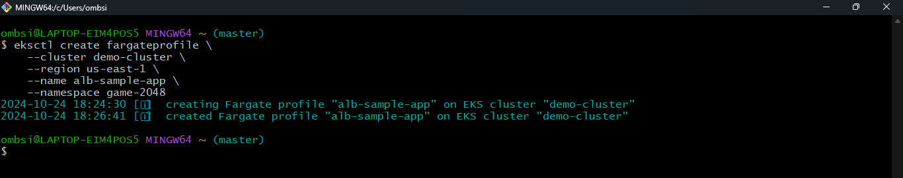

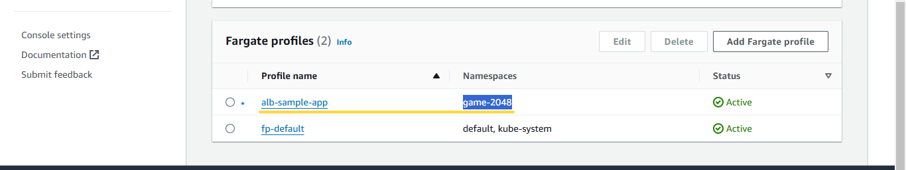
*You can see that a new Fargate profile has been created “alb-sample-app”*.

### 4. Deploy the 2048 Game Application:

**Now, let’s run the 2048 application. This includes creating a Kubernetes Pod, a service for the Pod, and an Ingress object that enables traffic to our application. To deploy everything at once, run**:

```bash
kubectl apply -f https://raw.githubusercontent.com/kubernetes-sigs/aws-load-balancer-controller/v2.5.4/docs/examples/2048/2048_full.yaml
```

*This command fetches the YAML configuration file that contains all the necessary definitions for our application*.

**After doing this you can check whether the pods, service and Ingress are created or not**.

```bash
kubectl get pods -n game-2048
```

```bash
kubectl get svc -n game-2048
```

```bash
kubectl get ingress -n game-2048
```

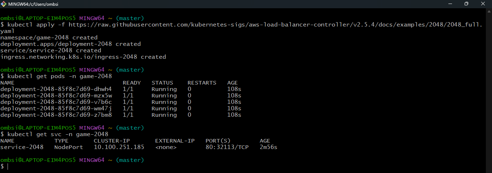

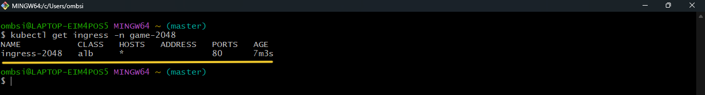

*Next, we need to set up an Ingress Controller. The Ingress Controller monitors Ingress resources and automatically creates an ALB for us. Before deploying it, we need to configure an IAM OIDC Provider*.

### 5. Next, you have to create and configure an IAM OIDC provider for your demo-cluster.

**Now Associate an IAM OIDC provider with your cluster**:

```bash
eksctl utils associate-iam-oidc-provider --cluster $cluster_name --approve
```

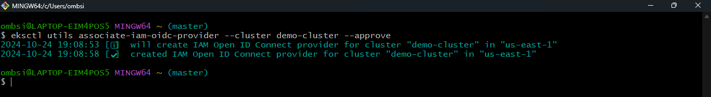


### 6. Setup for ALB controller add on.

**Firstly, download the IAM policy**.

```bash
curl -O https://raw.githubusercontent.com/kubernetes-sigs/aws-load-balancer-controller/v2.5.4/docs/install/iam_policy.json
```

**Now we will create IAM policy**.

```bash
aws iam create-policy \
    --policy-name AWSLoadBalancerControllerIAMPolicy \
    --policy-document file://iam_policy.json
```

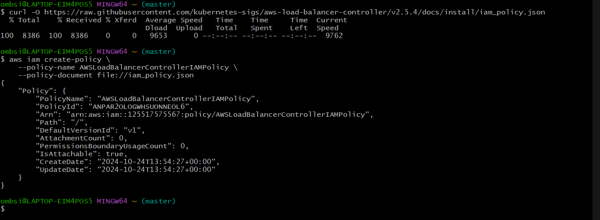

**Next, we’ll create a service account linked to an IAM role and policy that allows the ALB Controller to access the Load Balancer. Use the following command**:

```bash
eksctl create iamserviceaccount \
  --cluster=<your-cluster-name> \
  --namespace=kube-system \
  --name=aws-load-balancer-controller \
  --role-name AmazonEKSLoadBalancerControllerRole \
  --attach-policy-arn=arn:aws:iam::<your-aws-account-id>:policy/AWSLoadBalancerControllerIAMPolicy \
  --approve
```

*Make sure to replace <your-aws-account-id> with your actual AWS account ID*.

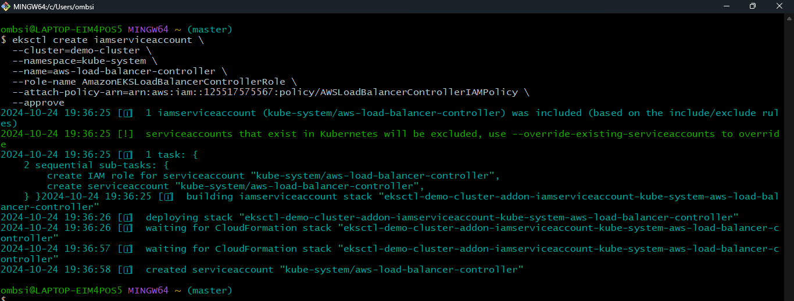

### 7. Finally, We’ll Deploy AWS Load Balancer Controller:

**Add the helm repo**.

```bash
helm repo add eks https://aws.github.io/eks-charts
```

**Then, update the repo**.

```bash
helm repo update eks
```

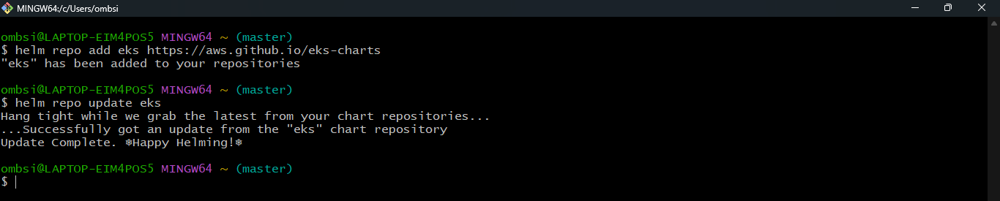


**Finally, install the ALB Controller**:

```bash
helm install aws-load-balancer-controller eks/aws-load-balancer-controller -n kube-system \
  --set clusterName=<your-cluster-name> \
  --set serviceAccount.create=false \
  --set serviceAccount.name=aws-load-balancer-controller \
  --set region=<region> \
  --set vpcId=<your-vpc-id>
```

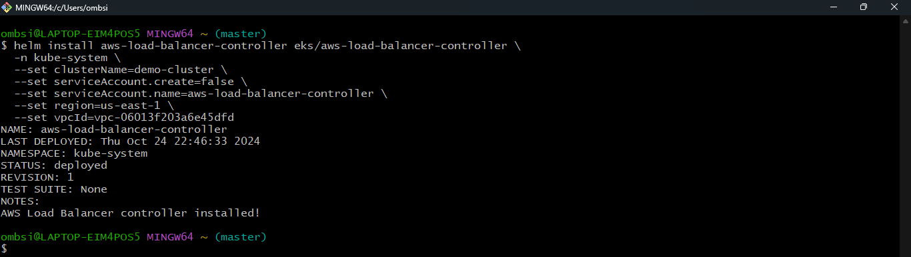

*This will create the application Load Balancer and expose the application onto the internet and you user will access the app using a single endpoint*

### 8. Verify and Access the Application:

**Verify that the deployments are running**.

```bash
kubectl get deployment -n kube-system aws-load-balancer-controller
```

**Wait 2–3 minutes until the ALB controllers are ready. Also check if an address is assigned for access**.

```bash
kubectl get ingress -n game-2048
```

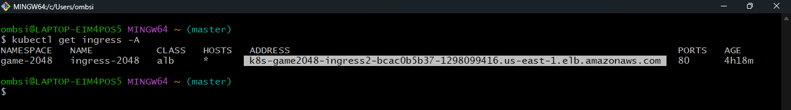

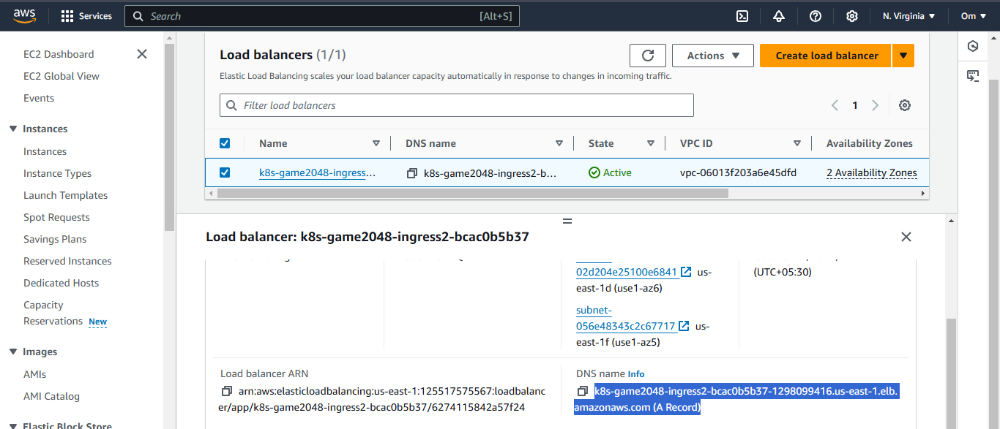

## Done !!!!!!!!!!!!!

## Access the URL and play with your app

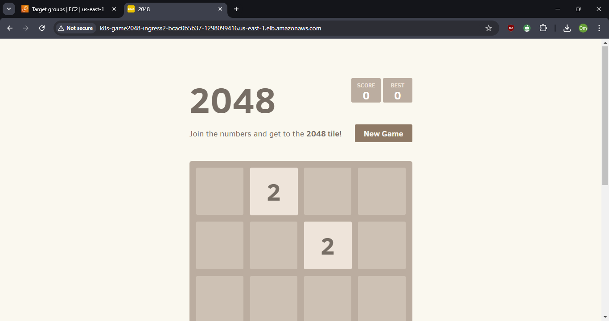

## Conclusion

This project involves running a simple gaming service on Amazon EKS using Fargate and Kubernetes Ingress. The AWS ALB Ingress Controller manages traffic to an application through an Application Load Balancer, which enables access over the Internet.


